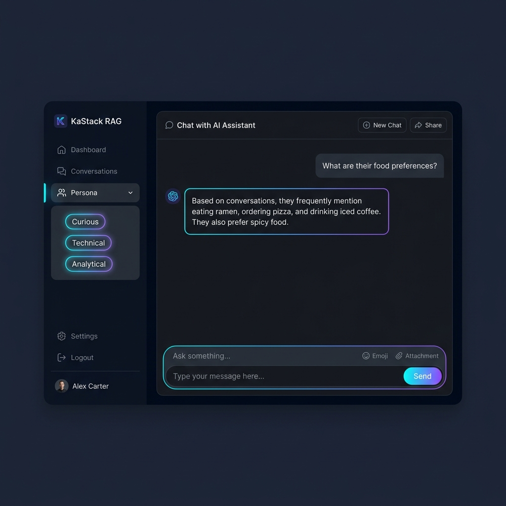

# KaStack RAG + Persona System



A production-aware **Retrieval-Augmented Generation (RAG)** system built on 11,000+ conversations. Extracts a multi-dimensional persona, detects topic boundaries semantically, and answers queries using two-stage FAISS retrieval — all without Langchain or LlamaIndex.

---

## Architecture Overview

```
conversations.csv
      │
      ▼
  loader.py          — parse CSV → flat Message list, sorted chronologically
      │
      ├─► checkpoints.py  — topic detection (cosine sim drift) + 100-msg structural checkpoints → Claude summaries
      │
      ├─► retriever.py    — build 2 FAISS indices (topic summaries + raw chunks)
      │
      └─► persona.py      — 3-pass extraction: facts, habits, communication style + personality
                                                        │
                                                        ▼
                                               api/main.py  (FastAPI)
                                                        │
                                               frontend/index.html (Chat UI)
```

---

## Stack

| Layer | Technology | Reason |
|---|---|---|
| Embeddings | `sentence-transformers` `all-MiniLM-L6-v2` | Lightweight (80MB), no API, 384-dim, strong semantic quality |
| Vector store | `FAISS` (CPU, IndexFlatIP) | In-memory, exact search, no infra overhead |
| LLM | Anthropic Claude (Haiku for summaries/persona, Sonnet for chat) | Best instruction-following for structured JSON tasks |
| Backend | FastAPI + Uvicorn | Async, type-safe, auto-docs at `/docs` |
| Frontend | Plain HTML/CSS/JS | Zero build step, fully self-contained |

---

## How Topic Change Detection Works

```
For each message i:
  1. embed(message_i) → vector e_i                     [MiniLM-L6-v2]
  2. Append e_i to current_topic_embeddings[]
  3. topic_centroid = mean(current_topic_embeddings)   [centroid of entire current topic]
  4. sim = cosine_similarity(e_i, topic_centroid)

  IF sim < 0.35 AND msgs_since_last_checkpoint >= 15:
     → declare TOPIC CHANGE
     → send segment to Claude → get 3-4 sentence summary
     → store TopicCheckpoint {topic_id, start_msg, end_msg, summary, embedding_of_summary}
     → reset: current_topic_embeddings = [e_i], msgs_since_last_checkpoint = 0
```

**Why 0.35?**  
MiniLM cosine similarities for related sentences: 0.5–0.9. Loosely related (same topic, tangent): 0.3–0.5. Unrelated topics: often below 0.3. At 0.35 we catch clear semantic shifts (food → travel, work → relationships) without fragmenting natural conversational tangents. Lower this (0.25) for coarser segments; raise it (0.45) for finer granularity.

**Why centroid of full topic (not rolling window only)?**  
Using the centroid of all messages in the current topic gives a stable, holistic representation of what's being discussed. A rolling window centroid drifts with recent messages and misses the topic's core meaning. We use the full-topic centroid for detection; the rolling window was an optional smoothing approach.

**100-message structural checkpoints** run independently — every 100 messages regardless of topic. These provide temporal coverage for time-based queries.

---

## How Retrieval Combines Topic Summaries + Raw Chunks

```
Query: "What restaurants did they mention?"

Stage 1 — Topic Summary Search:
  embed(query) → FAISS search on topic_summaries index → top 3 matching summaries
  [These give thematic context: "The conversation covered dining preferences..."]

Stage 2 — Raw Chunk Search:
  embed(query) → FAISS search on chunk index (20-msg overlapping windows, stride=15) → top 5 chunks
  [These give verbatim evidence: "User 1: I love the Thai place on Main St"]

Context assembly (order matters for Claude):
  === RELEVANT TOPIC SUMMARIES ===
  [Topic 1] ...summary text...
  [Topic 2] ...summary text...

  === SUPPORTING CONVERSATION EXCERPTS ===
  [Excerpt 1] User 1: I went to...
  ...

→ Claude generates answer with this context + persona summary in system prompt
```

**Why two indices?**  
Summaries capture distilled semantic signal — great for broad thematic queries. Raw chunks preserve verbatim wording — great for specific fact recall. The combination gives both precision and recall without a re-ranker.

**Why overlapping chunks (overlap=5)?**  
Without overlap, a key utterance at a chunk boundary falls into two separate chunks, neither of which retrieves it cleanly. 5-message overlap ensures boundary content appears fully in at least one chunk.

---

## How Persona is Built in Passes (Not One-Shot)

```
All 11k conversations (flattened messages)
         │
         ├─ Pass 1: Facts (batches of 50 msgs)
         │   Prompt: "Extract names, places, relationships, events. JSON only."
         │   → merge + deduplicate across all batches
         │
         ├─ Pass 2: Habits (batches of 50 msgs)
         │   Prompt: "Identify sleep, food, routines. JSON only."
         │   → merge + deduplicate
         │
         ├─ Pass 3a: Communication stats (ALL messages, programmatic — no LLM)
         │   → avg message length, std dev, emoji frequency, question ratio,
         │      slang/abbreviation ratio → classifies emoji usage as high/medium/low
         │
         └─ Pass 3b: Personality (100-msg random sample → Claude)
             Prompt: "List 5-8 personality traits and tone. JSON only."
```

**Why batched, not one-shot?**
- A single prompt over 11k conversations exceeds all LLM context windows
- Focused single-task prompts (facts only / habits only) produce cleaner, more reliable JSON
- Programmatic stats are deterministic and verifiable — no hallucination risk
- Sampling 100 messages for personality is sufficient; sending everything is expensive with diminishing returns

---

## Project Structure

```
KaStack-RAG/
├── data/
│   └── conversations.csv          # 11k+ multi-turn conversations
├── pipeline/
│   ├── __init__.py
│   ├── loader.py                  # CSV → Message list (chronological)
│   ├── embedder.py                # sentence-transformers wrapper + cosine utils
│   ├── checkpoints.py             # topic detection + structural checkpoints
│   ├── retriever.py               # 2-stage FAISS retriever
│   └── persona.py                 # 3-pass persona extraction
├── api/
│   ├── __init__.py
│   └── main.py                    # FastAPI app (chat, persona, checkpoints endpoints)
├── frontend/
│   └── index.html                 # Chat UI (no build step required)
├── indices/                       # Generated: FAISS index files
├── build_pipeline.py              # One-shot pipeline build script
├── persona.json                   # Generated: persona artifact
├── checkpoints.json               # Generated: checkpoint artifact
├── requirements.txt
├── .env.example
└── README.md
```

---

## Local Setup & Run

### 1. Install dependencies

```bash
cd /path/to/KaStack-RAG
python -m venv venv
source venv/bin/activate    # Windows: venv\Scripts\activate
pip install -r requirements.txt
```

### 2. Configure environment

```bash
cp .env.example .env
# Edit .env — add your ANTHROPIC_API_KEY
```

### 3. Build the pipeline (one-time, ~20-60 min depending on dataset size)

```bash
python build_pipeline.py
```

This runs checkpointing + FAISS index build + persona extraction.  
Use flags to control what runs:

```bash
python build_pipeline.py --skip-persona          # skip persona pass (save API calls)
python build_pipeline.py --skip-checkpoints      # skip checkpoint build
python build_pipeline.py --rebuild               # force full rebuild
```

### 4. Start the API server

```bash
uvicorn api.main:app --reload --host 0.0.0.0 --port 8000
```

### 5. Open the chat UI

Visit [http://localhost:8000](http://localhost:8000) — the frontend is served by FastAPI.

API docs at [http://localhost:8000/docs](http://localhost:8000/docs)

---

## API Endpoints

| Method | Endpoint | Description |
|---|---|---|
| `POST` | `/chat` | Send `{query, include_sources}` → get `{answer, mode, sources}` |
| `GET` | `/persona` | Returns full persona JSON |
| `GET` | `/checkpoints` | Returns all topic checkpoints with summaries |
| `POST` | `/build` | Trigger full pipeline build (admin, runs in background) |
| `GET` | `/health` | Liveness + readiness check |

---

## Design Decisions Worth Noting

- **No Langchain/LlamaIndex** — retrieval logic is written from scratch so every decision is visible and explainable.
- **Haiku for summaries, Sonnet for chat** — Haiku is fast and cheap for bulk summarisation (hundreds of API calls). Sonnet delivers better answer quality for user-facing responses.
- **FAISS IndexFlatIP** — exact cosine search (via dot product on L2-normalised embeddings). Approximate methods (HNSW, IVF) would be faster at scale but introduce recall tradeoffs not worth making for ~11k conversations.
- **Cosine over the full topic centroid** — more stable than a rolling window alone; captures the topic's overall semantic identity.
- **Persona capped at 5000 messages for LLM passes** — cost control. Programmatic stats always run on all messages.
